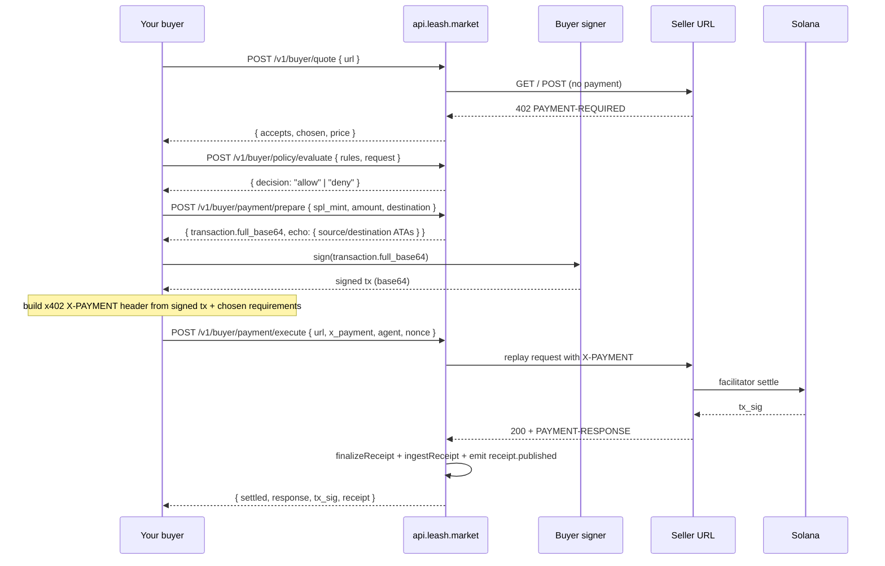

The buyer side of x402 is harder to expose as a single HTTP call
than the seller side, because the buyer holds the private key. The
API can't sign for you. Instead, the eight `/v1/buyer/*` endpoints
break the buyer flow down into discrete primitives that mirror the
TypeScript [`@leash/buyer-kit`](/sdk/buyer-kit) one-to-one:

| Endpoint                            | Purpose                                                       | IO   |
| ----------------------------------- | ------------------------------------------------------------- | ---- |
| `POST /v1/buyer/quote`              | Probe a URL, decode `payment-required`, return `accepts[]`    | HTTP |
| `POST /v1/buyer/policy/evaluate`    | Pure RulesV1 gate (host / budget / per-call ceiling)          | None |
| `POST /v1/buyer/payment/prepare`    | Build an unsigned SPL `TransferChecked` from buyer ATA        | None |
| `POST /v1/buyer/payment/execute`    | Replay the seller request with `X-PAYMENT` + ingest receipt   | HTTP |
| `POST /v1/buyer/receipt/finalize`   | Compute `receipt_hash` for a draft (pure)                     | None |
| `POST /v1/buyer/receipt/verify`     | Verify a chain (hashes / nonces / `prev_receipt_hash` links)  | None |
| `GET  /v1/buyer/networks`           | Buyer-side network catalog                                    | None |
| `GET  /v1/buyer/currency`           | Stablecoins payable on the caller-scoped network              | None |

You stay in control of the signer. The API stays in control of the
receipt index, watchlist, and webhook fan-out. Together they let
you script a buyer in **any language with an HTTP client and a
Solana signer** — Python, Go, Rust, a Cloudflare Worker, anything.

## Flow at a glance



You can also stop after `payment/prepare`, sign locally, and
broadcast yourself via [`POST /v1/submit`](/api/prepare-submit) if
you want to skip the API's seller proxy. `payment/execute` is the
convenience path; `prepare` + your own broadcaster is the bare-metal
path.

## `POST /v1/buyer/quote`

Probes a URL with no payment header and decodes the seller's
`payment-required` response into a structured `accepts[]` plus a
network-aware "chosen" pick.

```http
POST /v1/buyer/quote
Authorization: Bearer lsh_test_...
Content-Type: application/json

{
  "url": "https://api.example.com/quote",
  "method": "GET",
  "preferred_currency": "USDC"
}
```

```json
{
  "status": 402,
  "accepts": [
    {
      "scheme": "exact",
      "network": "solana-devnet",
      "asset": "4zMM…",
      "payTo": "9pK9…",
      "amount": "1000",
      "description": "Tag a payload"
    }
  ],
  "chosen": { "...": "..." },
  "price": { "amount": "1000", "currency": "USDC", "asset": "4zMM…", "network": "solana-devnet" },
  "requirements_hash": "8d5a…",
  "payment_required_header": "eyJ4NDAyVmVyc2lvbiI6Mi…",
  "seller_error": null
}
```

`chosen` is the entry from `accepts[]` whose network matches the
caller's API key, optionally filtered by `preferred_currency`. When
the seller does not accept the caller-scoped network at all,
`chosen` is `null` and you should switch keys (and treasury) to
match the seller's cluster.

`requirements_hash` is the SHA-256 of the canonical JSON form of
`chosen` — the same value the receipt's
`payment_requirements_hash` will hold after settlement. Pre-compute
it client-side to fail loudly when the seller's offer changes
between quote and execute.

`502 rpc_error` if the probe target is unreachable (DNS, TLS,
timeout). The `seller_error` field carries any `error` string the
seller embedded in the `payment-required` payload — useful when the
seller refuses to quote without authentication.

## `POST /v1/buyer/policy/evaluate`

A pure HTTP wrapper around `evaluate` from `@leash/core`. No IO, no
state writes, just the policy gate from
[`RulesV1`](/schemas/rules-v1).

```http
POST /v1/buyer/policy/evaluate
Authorization: Bearer lsh_test_...
Content-Type: application/json

{
  "request": {
    "method": "GET",
    "url": "https://api.example.com/quote",
    "estimated_price": "0.001"
  },
  "rules": {
    "v": "0.1",
    "budget": { "daily": "10", "perCall": "0.01", "currency": "USDC" },
    "hosts": { "allow": ["api.example.com"] },
    "triggers": []
  },
  "state": {
    "spent_today": "0.5",
    "recent_request_hashes": []
  }
}
```

```json
{
  "decision": "allow",
  "reason": null,
  "request_hash": "9b3a…"
}
```

Possible `reason` values for a `deny` decision: `replay`,
`denyHost`, `allowHost`, `priceCeiling`, `dailyBudgetExceeded`,
`perCallMax`. Recording `request_hash` in your local state and
passing it back via `recent_request_hashes` is what makes replay
detection work — the API never sees your state between calls.

## `POST /v1/buyer/payment/prepare`

Builds an unsigned SPL `TransferChecked` from the buyer's source ATA
to the seller's `payTo` ATA. The shape mirrors every other prepare
endpoint — see [Prepare → Submit](/api/prepare-submit) for the
contract.

```http
POST /v1/buyer/payment/prepare
Authorization: Bearer lsh_test_...
Content-Type: application/json

{
  "payer": "<buyer wallet pubkey>",
  "spl_mint": "4zMMC9srt5Ri5X14GAgXhaHii3GnPAEERYPJgZJDncDU",
  "destination": "9pK9LhEt2zUWgSGRhJ6KCfb7vBCjwT5b7yT8sX6sR2tV",
  "amount": "1000",
  "decimals": 6,
  "token_program": "spl"
}
```

```json
{
  "event_id": "01HVTQX4GZ…",
  "network": "solana-devnet",
  "transaction": {
    "message_base64": "AQABAv…",
    "full_base64": "AQABAv…",
    "blockhash": "GZNb…",
    "signers": ["<buyer wallet pubkey>"]
  },
  "echo": {
    "source_token_account": "<buyer USDC ATA>",
    "destination_token_account": "<seller USDC ATA>",
    "mint": "4zMM…",
    "amount": "1000",
    "decimals": 6,
    "token_program": "TokenkegQfeZyiNwAJbNbGKPFXCWuBvf9Ss623VQ5DA"
  }
}
```

What this does:

- Derives `source_token_account` as `ATA(payer, mint, token_program)` — pass `source_token_account` explicitly to override (e.g. when spending as the SPL **delegate** of an agent treasury).
- Derives `destination_token_account` as `ATA(destination, mint, token_program)`.
- Builds a `TransferChecked` for `amount` atomic units (the integrity check uses your `decimals` so the API doesn't have to fetch the mint).
- Drops a `buyer.payment.prepare` event row with `phase=prepared` so the explorer shows the in-flight transfer.
- Auto-watches the destination's owning agent treasury via `ensureWatched` so any subsequent on-chain activity for that agent shows up in the explorer feed.

The signed transaction can either be broadcast via
[`POST /v1/submit`](/api/prepare-submit) (if you don't need the
seller-kit replay) or wrapped into the `X-PAYMENT` header for
[`/v1/buyer/payment/execute`](#post-v1buyerpaymentexecute) below.

## `POST /v1/buyer/payment/execute`

The convenience path. The API replays the original seller request
with the buyer-supplied `X-PAYMENT` header attached, parses the
`PAYMENT-RESPONSE`, finalizes a `spend` `ReceiptV1`, and ingests it
into the receipt store + explorer feed. You get back the seller's
response body verbatim plus the receipt and tx signature.

```http
POST /v1/buyer/payment/execute
Authorization: Bearer lsh_test_...
Content-Type: application/json

{
  "url": "https://api.example.com/quote",
  "method": "GET",
  "x_payment": "<base64 X-PAYMENT header value>",
  "agent": "BcN4ToBs8jE3dbYNhYqDJqGnKPjH3zRX8gsDUDH72JQp",
  "nonce": 42,
  "prev_receipt_hash": "rh_a1f3…",
  "expected_payment": {
    "scheme": "exact",
    "network": "solana-devnet",
    "asset": "4zMM…",
    "payTo": "9pK9…",
    "amount": "1000"
  }
}
```

```json
{
  "settled": true,
  "response": {
    "status": 200,
    "headers": { "content-type": "application/json", "PAYMENT-RESPONSE": "eyJ0cmFuc2…" },
    "body_text": "{\"pair\":\"SOL/USD\",\"price\":142.71}"
  },
  "tx_sig": "5xY7…",
  "receipt": {
    "v": "0.1",
    "kind": "spend",
    "agent": "BcN4…",
    "nonce": 42,
    "decision": "allow",
    "tx_sig": "5xY7…",
    "payment_requirements_hash": "8d5a…",
    "receipt_hash": "rh_b1e2…",
    "...": "..."
  },
  "receipt_event_id": "01HVTQX4GZ…",
  "failure_reason": null
}
```

When the seller refuses to settle (the second request still returns
`402`, the facilitator errors, etc.), the API still writes a receipt —
with `decision: "rejected"` and a non-null `failure_reason`. The
receipt is the audit trail; you can show it to the user without
guessing what happened.

The `expected_payment` field is optional but recommended: if the
seller's settled `paymentRequirements` (decoded from
`PAYMENT-RESPONSE`) doesn't match what you quoted, the receipt's
price will reflect the actual charged amount, and you can compare
against `expected_payment` client-side to alert on dynamic-pricing
mismatches.

## `POST /v1/buyer/receipt/finalize`

Pure helper that computes `receipt_hash` for a draft receipt. Useful
when you want to chain receipts client-side without holding the
whole `@leash/core` library in your runtime.

```http
POST /v1/buyer/receipt/finalize
Authorization: Bearer lsh_test_...
Content-Type: application/json

{
  "v": "0.1",
  "kind": "spend",
  "agent": "BcN4…",
  "nonce": 0,
  "ts": "2026-04-25T01:00:00.000Z",
  "policy_v": "0.1",
  "request": { "method": "GET", "url": "https://api.example.com/quote", "body_hash": null },
  "decision": "allow",
  "reason": null,
  "price": { "amount": "1000", "currency": "USDC" },
  "facilitator": "https://facilitator.svmacc.tech",
  "tx_sig": "5xY7…",
  "payment_requirements_hash": "8d5a…",
  "response": { "status": 200, "body_hash": null },
  "prev_receipt_hash": null
}
```

```json
{
  "receipt_hash": "9a3f…",
  "receipt": { "...": "draft echoed back with `receipt_hash` filled in" }
}
```

Same byte output as `finalizeReceipt` from `@leash/core`. Idempotent.

## `POST /v1/buyer/receipt/verify`

Verifies a chain of receipts: each `receipt_hash` is recomputed,
each `prev_receipt_hash` link is checked, and `nonce` strictly
increases.

```http
POST /v1/buyer/receipt/verify
Authorization: Bearer lsh_test_...
Content-Type: application/json

{ "chain": [ { "...receipt 1..." }, { "...receipt 2..." } ] }
```

Or, easier on long chains:

```json
{ "jsonl": "{...receipt1}\n{...receipt2}\n{...receipt3}" }
```

Response on success:

```json
{ "ok": true, "count": 3 }
```

On failure, the response carries the bad receipt's nonce and a
human-readable reason:

```json
{ "ok": false, "nonce": 17, "reason": "receipt_hash_mismatch" }
```

This is the same `verifyReceiptChain` from `@leash/core` —
identical results, no JS dependency.

## `GET /v1/buyer/networks`

Buyer-side network catalog. Same shape as the seller side, but
named for symmetry with `@leash/buyer-kit`.

```http
GET /v1/buyer/networks
Authorization: Bearer lsh_test_...
```

```json
{
  "items": [
    {
      "network": "solana-devnet",
      "caip2": "solana:EtWTRABZ…",
      "facilitator": "https://facilitator.svmacc.tech",
      "accepts": ["USDC", "USDT", "USDG"],
      "currencies": [
        { "symbol": "USDC", "name": "USD Coin", "mint": "4zMM…", "decimals": 6, "program": "spl-token" }
      ]
    }
  ],
  "current": { "network": "solana-devnet", "...": "..." }
}
```

## `GET /v1/buyer/currency`

Just the stablecoins the buyer can settle in on the caller-scoped
network. Ideal for a "Pay with: [USDC ▾]" dropdown.

```http
GET /v1/buyer/currency
Authorization: Bearer lsh_test_...
```

```json
{
  "network": "solana-devnet",
  "items": [
    { "symbol": "USDC", "name": "USD Coin", "mint": "4zMM…", "decimals": 6, "program": "spl-token" },
    { "symbol": "USDT", "name": "Tether USD", "mint": "Es9v…", "decimals": 6, "program": "spl-token" },
    { "symbol": "USDG", "name": "Global Dollar", "mint": "...",  "decimals": 6, "program": "spl-token-2022" }
  ]
}
```

## See also

- [`@leash/buyer-kit`](/sdk/buyer-kit) — the TypeScript surface
  these endpoints mirror, including failure-classification
  ergonomics for the SDK use case.
- [Payment links](/api/payment-links) — the seller-side endpoint
  buyers most often pay against.
- [Receipts API](/api/receipts) — what `receipt.published` means
  and how to query the resulting feed.
- [Prepare → Submit](/api/prepare-submit) — alternate flow when you
  want to broadcast the prepared transfer yourself.
