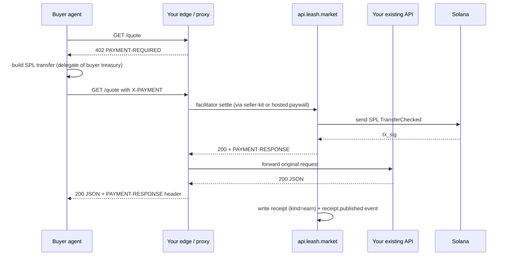

Leash adds the x402 `402`, settles the SPL transfer through a real
facilitator, credits your agent's **Asset Signer PDA** treasury, and
writes a chained `ReceiptV1` for every call — all visible on
[`explorer.leash.market`](https://explorer.leash.market).

## Pick your integration shape

| Shape                             | Best when                                                             | You ship                                         |
| --------------------------------- | --------------------------------------------------------------------- | ------------------------------------------------ |
| **Hosted payment link**           | Fixed or templated JSON response, zero new infra, sharable URL        | `POST /v1/payment-links` → share `share_url`     |
| **Sidecar (`@leashmarket/seller-kit`)** | Your API is TypeScript / Hono; you want the route inside your process | `createSeller` + env for receipt fan-out         |
| **Edge (any language)**           | Python / Go / Rust / Worker in front of your route                    | Buyer + seller HTTP utilities, or link + webhook |

All three settle the same way on-chain and emit the same explorer /
metrics events once the seller agent is set up correctly.

## Step 0 — Create your seller agent (once per mint)

Every monetised route needs an **owner agent** (one MPL Core mint). The
x402 `payTo` is derived from that asset; explorer and metrics key off
the same mint.

**Create the mint + Agent Identity**

- **HTTP (any language):** [`POST /v1/agents/prepare`](/api/agents) →
  sign `transaction.base64` → [`POST /v1/submit`](/api/prepare-submit)
  → poll [`GET /v1/events/{id}`](/api/prepare-submit) until
  `phase: confirmed`. The prepare path auto-watchlists the new agent for
  the indexer.
- **TypeScript:** [`createAgent`](/sdk/registry-utils) or
  [`prepareAgentMint`](/sdk/registry-utils) +
  [`sendPreparedAgentMint`](/sdk/registry-utils) from
  `@leashmarket/registry-utils` — same on-chain result as the API.

**Seller-only checklist (receive USDC / USDT / USDG — payment links,
seller-kit, or any earn flow)**

You are **not** spending from the treasury here; you only need inbound
ATAs and visibility:

1. **Provision ATAs** for every stable you list in `accepts` (or the
   link will fail at settle when the treasury has no account for that
   mint): `POST /v1/agents/{mint}/treasury/provision/prepare` → sign →
   `POST /v1/submit` (idempotent; `no_op` if already done).
2. **Enrol the treasury for explorer fund events:** call
   [`GET /v1/agents/{mint}/treasury/balances`](/api/treasury) once after
   provisioning. That registers the PDA + ATAs on the watchlist. See
   [Explorer tracking](/api/explorer-tracking#standard-integration-sequences)
   for the full copy-paste sequence.

**Optional — same mint will also _pay_ x402 (buyer capability)**

Only then wire the executive + SPL spend delegation:

- `POST /v1/agents/{mint}/executive/register/prepare` → submit
- `POST /v1/agents/{mint}/executive/delegate/prepare` → submit
- `POST /v1/agents/{mint}/delegation/prepare` (SPL `Approve` from
  treasury to executive) → submit

Each step is prepare → sign → submit. Details:
[Prepare → Submit](/api/prepare-submit), [Treasury](/api/treasury).

## Try it in the playground (no API key in the browser)

The web app ships a **Payment-Link Builder** at `/seller` — same x402
semantics as the hosted API, useful before you script `curl`. Walkthrough:
[Create a payment link](/guides/create-an-endpoint).

## Hosted payment links (fastest path)

One `POST` creates a public paywall on `api.leash.market`:

```bash
curl -sS -X POST https://api.leash.market/v1/payment-links \
  -H "Authorization: Bearer $LEASH_API_KEY" \
  -H "Content-Type: application/json" \
  -d '{
    "label": "Pro tier endpoint",
    "owner_agent": "BcN4ToBs8jE3dbYNhYqDJqGnKPjH3zRX8gsDUDH72JQp",
    "method": "GET",
    "price": "$0.01",
    "currency": "USDC",
    "response": {
      "status": 200,
      "mimeType": "application/json",
      "body": { "ok": true, "tier": "pro" }
    }
  }'
```

The JSON body includes `share_url` (public paywall), `pay_to`, and
`accepts[]`. Buyers hit it, receive `402` + `PAYMENT-REQUIRED`, sign
`TransferChecked`, replay with `X-PAYMENT`, and get your configured
response after settlement. Full CRUD, hooks, and counters:
[Payment links](/api/payment-links).

To **proxy** your existing SaaS after payment, set `response` to forward
to your backend (see that page for the `proxy` / template fields) so
you do not duplicate business logic in static JSON.

## End-to-end flow (sidecar / edge)

When the paid response comes from a route you already run, the
handshake is the same:



The buyer does not reach your origin until they pay. Your origin does
not need to speak x402 — Leash handles that at the edge or inside the
hosted paywall.

## Sidecar mode (TypeScript / Hono)

[`@leashmarket/seller-kit`](/sdk/seller-kit) exposes `createSeller(app,
options)` — real `@x402/hono` middleware, Asset Signer PDA as `payTo`,
and **implicit** receipt fan-out to the Leash API when both env vars are
set and you **omit** a custom `onReceipt` callback (same rules as
[`@leashmarket/buyer-kit`](/sdk/buyer-kit): a function passed as `onReceipt`
replaces the default sink entirely).

```ts
import { Hono } from 'hono';
import { createUmi } from '@metaplex-foundation/umi-bundle-defaults';
import { mplCore } from '@metaplex-foundation/mpl-core';
import { createSeller } from '@leashmarket/seller-kit';

const umi = createUmi(process.env.SOLANA_RPC_URL!).use(mplCore());
const app = new Hono();

createSeller(app, {
  umi,
  sellerAgent: { asset: process.env.LEASH_SELLER_AGENT! },
  routes: {
    'GET /quote': { price: '$0.01', currency: 'USDC' },
  },
  // Receipts forward automatically when both are set:
  //   LEASH_API_URL=https://api.leash.market
  //   LEASH_API_KEY=lsh_live_...
});

app.get('/quote', (c) => c.json({ pair: 'SOL/USD', price: 142.71 }));
```

`LEASH_SELLER_AGENT` must be a mint that completed **Step 0** (create +
provision + balances ping). Skipping provisioning does not block every
settle, but treasury **fund** lines on the explorer may never appear.

**How forwarding works:** when `onReceipt` is **undefined** (as in the
snippet above) and `LEASH_API_URL` plus `LEASH_API_KEY` are set, the
**default receipt sink** POSTs each settled `ReceiptV1` to
`POST /v1/receipts/{agent}` on the API. That ingests the row, emits
`receipt.published`, and joins the explorer timeline. Omit those env
vars and nothing is forwarded to the API (only runner, if
`LEASH_RUNNER_URL` is set). Pass `onReceipt: false` to disable publishing
entirely, even when env vars are present.

## Edge mode (any language)

### Option A — payment link + webhook

Create a link with `webhook_url` pointing at your backend. On settle,
Leash POSTs a `payment_link.settled` payload (see
[Payment links](/api/payment-links)) so you can flip entitlements,
enqueue jobs, or issue API keys without the buyer hitting your service
first.

### Option B — buyer HTTP utilities

For a true 402 dance on a URL you control, the
[buyer endpoints](/api/buyer) mirror `@leashmarket/buyer-kit` **but execute on
Leash’s servers**: your server calls `api.leash.market` with your API key,
and **`POST /v1/buyer/payment/execute`** finalises the spend receipt **inside
the API** — so explorer / `receipt.published` do **not** depend on
`LEASH_API_URL` in your buyer process (unlike a Node app that uses
`createBuyer` with the default sink and no custom `onReceipt`).

```bash
curl -sS -X POST https://api.leash.market/v1/buyer/quote \
  -H "Authorization: Bearer $LEASH_API_KEY" \
  -H "Content-Type: application/json" \
  -d '{ "url": "https://api.example.com/quote", "method": "GET" }'

curl -sS -X POST https://api.leash.market/v1/buyer/payment/execute \
  -H "Authorization: Bearer $LEASH_API_KEY" \
  -H "Content-Type: application/json" \
  -d '{ "url": "https://api.example.com/quote", "x_payment": "<base64>", "agent": "...", "nonce": 1 }'
```

[`POST /v1/buyer/payment/execute`](/api/buyer) replays the request,
parses `PAYMENT-RESPONSE`, finalises a **spend** receipt, and returns the
seller body plus `tx_sig`.

For seller-side helpers without Node (`networks`, `facilitator`,
`parse-price`, `pay-to`), use [Seller utilities](/api/seller-utils).

## What you get

- **Pay-per-call settlement** — real SPL transfer, explorer `tx/` link.
- **Hosted paywalls** — `/x/{id}` with counters and idempotent creates.
- **Receipt feed** — `GET /v1/receipts/{agent}`; verify with
  `@leashmarket/core` or [`POST /v1/buyer/receipt/verify`](/api/buyer).
- **Treasury control** — owner-driven withdraw via
  [`/v1/agents/{mint}/treasury/.../prepare`](/api/treasury).

Automated **refunds / cashback** are on the [roadmap](/api/roadmap) (not
shipped yet). Until then, use owner withdraw to move stables manually.

## What you owe — the 1% Leash protocol fee

Every settlement routed through a Leash facilitator (devnet or mainnet
hosted, or any self-hosted facilitator running `@leashmarket/facilitator`)
adds a **second `TransferChecked`** for the same mint to the Leash fee
treasury. The math is unconditional and visible in the buyer's signed
transaction:

- The seller is **always quoted net.** The price you set on the link or
  in `createSeller` is exactly what lands in your `payTo` ATA.
- The buyer pays `gross = amount + fee`, where `fee = ceil(amount *
100 / 10_000)` — `1.00%` ceiling-rounded in atoms.
- The fee leg targets a Leash-owned wallet identical on both clusters:
  `3DdcJkvjW7KLtMeko3Zr57jEJWhqRHuPsEBFm1XJYh7W`. Verify it live on
  `GET /v1/health` (`protocol_fee.authorities`).
- Receipts (`earn` _and_ `spend`) carry the breakdown:
  `price.amount`, `price.fee`, `price.gross`, `price.feeBps`,
  `price.feeAuthority`. The explorer surfaces this as a "Settlement
  breakdown" panel and aggregates collected fees per mint under
  `protocol.fee.collected` events.
- Sellers stamp `paymentRequirements.extra['leash.fee']` on the 402 so
  buyers can verify the rate _before_ signing. Vanilla x402
  facilitators (no Leash semantics on `/health`) settle for `amount`
  flat — the fee leg is only enforced when the facilitator advertises
  it.

For the wire shape, math worked examples, allowance gross-up guidance,
and the `LEASH_FEE_*` env knobs, see
[Protocol fee](/api/protocol-fee).

## Which shape should I pick?

| Question                    | Hosted link    | Sidecar             | Edge         |
| --------------------------- | -------------- | ------------------- | ------------ |
| Response is fixed JSON      | **Yes**        | Yes                 | Yes          |
| API is TypeScript / Node    | Yes            | **Yes**             | Possible     |
| Zero new processes          | **Yes**        | Same as your server | Needs worker |
| Language must stay polyglot | **Yes** (curl) | No                  | **Yes**      |
| Sharable URL out of the box | **Yes**        | DIY                 | DIY          |

Most teams ship the first dollar with a **hosted payment link**, move
to **seller-kit** when the response is dynamic and already lives in
Node, and use **edge mode** when the stack is not TypeScript.
