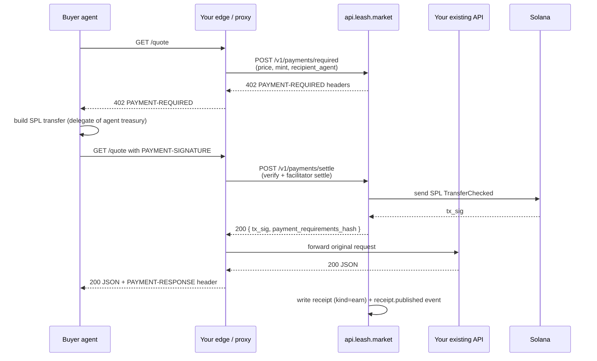

Leash is the easiest way to monetise an HTTP API. You keep your
endpoint exactly as it is. Leash adds the 402, settles the SPL
transfer through a real x402 facilitator, hands the proceeds to a
treasury you control, and writes a chained receipt for every call —
all visible on [`explorer.leash.market`](https://explorer.leash.market).

Two integration shapes are supported:

1. **Sidecar mode (Hono / Node middleware)** — drop `@leash/seller-kit`
   into the same process, add three env vars, ship.
2. **Edge mode (any language)** — call the Leash API in front of your
   existing route from a tiny worker / proxy. The settlement and
   receipt logic lives on `api.leash.market`; your service just keeps
   responding with normal JSON for paid requests.

Both produce the same on-chain result, the same explorer entries,
and the same receipt feed.

## End-to-end flow



The buyer never sees your service until they pay. Your service never
has to learn x402 — Leash does that handshake on the edge.

## Sidecar mode (TypeScript / Hono)

If your API is a Node service, the cleanest path is `@leash/seller-kit`.
It gives you `createSeller(app, options)` that adds the 402 middleware
in one line, optionally forwards every produced receipt to the Leash
API on `api.leash.market`, and shows up in the explorer with no extra
code.

```ts
import { Hono } from 'hono';
import { createSeller } from '@leash/seller-kit';

const app = new Hono();

createSeller(app, {
  agent: process.env.LEASH_SELLER_AGENT!, // recipient mint
  network: 'solana-mainnet',
  routes: [{ method: 'GET', path: '/quote', price: { amount: '0.01', currency: 'USDC' } }],
  // Receipts are forwarded automatically when both env vars are set:
  //   LEASH_API_URL=https://api.leash.market
  //   LEASH_API_KEY=lsh_live_...
  // To opt out for a single seller: receipts: false
});

app.get('/quote', (c) => c.json({ pair: 'SOL/USD', price: 142.71 }));
```

That's the entire integration. The sidecar will:

- Return `402` for unpaid callers with the right `PAYMENT-REQUIRED`
  headers.
- Verify the buyer's signature, hand it to the configured facilitator,
  and re-run the request once the SPL transfer lands.
- Build a `ReceiptV1` for every settled call and POST it to your
  agent's `/v1/receipts/{agent}` endpoint on the Leash API. Set
  `receipts: false` to keep receipts purely local.

See [`@leash/seller-kit`](/sdk/seller-kit) for the full options surface.

## Edge mode (any language)

If your service is in Python / Go / Rust / a Cloudflare Worker, sit
the Leash API in front of it. Two HTTP calls per request, no SDK.

### 1. On the unpaid request, return the 402 the API builds for you

```http
POST https://api.leash.market/v1/payments/required
Authorization: Bearer lsh_live_...
Content-Type: application/json

{
  "agent": "4Yp9…",                  # recipient agent (this is your seller)
  "price": { "amount": "0.01", "currency": "USDC" },
  "method": "GET",
  "path": "/quote",
  "host": "api.example.com"
}
```

Response is a ready-made set of `PAYMENT-REQUIRED` headers and a
`requirements_hash` — copy them into your 402 response verbatim.

### 2. On the second request (with `PAYMENT-SIGNATURE`), settle through the API

```http
POST https://api.leash.market/v1/payments/settle
Authorization: Bearer lsh_live_...
Content-Type: application/json

{
  "agent": "4Yp9…",
  "requirements_hash": "…",
  "payment_header": "<value of PAYMENT-SIGNATURE from buyer>",
  "request_hash": "<sha256 of canonical request>"
}
```

On `200`, the SPL transfer has landed and you have a `tx_sig`. Forward
the original request to your real backend and respond to the buyer
with the API-provided `PAYMENT-RESPONSE` header attached. The Leash
API has already written the receipt and emitted the
`receipt.published` event by the time you get the response.

This is exactly what the sidecar does — you're just choosing where
the glue runs.

## What you get out of the box

- **Pay-per-call settlement.** Real SPL transfer, real on-chain tx,
  real explorer link.
- **Receipts feed.** `GET /v1/receipts/{agent}` is ordered, paginated,
  cursor-based. The chain is verifiable end-to-end with
  `verifyReceiptChain` from `@leash/core`.
- **Explorer entries.** Each settled call shows up at
  `https://explorer.leash.market/tx/<signature>` and
  `https://explorer.leash.market/agent/<mint>`.
- **Treasury control.** Funds land on the Asset Signer PDA. Use
  `POST /v1/agents/{mint}/treasury/withdraw/prepare` to pull them out
  to any wallet, signed by the asset's owner.
- **Refunds & cashback.** On the [roadmap](/api/roadmap#refunds--cashback),
  **not yet shipped**. The planned surface is `POST /v1/payments/refund`
  (full inverse transfer) and `POST /v1/payments/cashback` (partial
  rebate based on a `CashbackRulesV1` doc you set per agent —
  e.g. 1% back on every settled call, tiered by ticket size, or a
  loyalty-window rebate every Nth call). Both will write a
  `refund` / `cashback` receipt linked back to the original `tx_sig`
  so the chain stays verifiable end-to-end. Until then, run a manual
  `POST /v1/agents/{mint}/treasury/withdraw/prepare` against the
  buyer's mint as a one-off rebate.

## Deciding between sidecar and edge

| Question                                     | Sidecar (seller-kit)                                                    | Edge (Leash API in front)                  |
| -------------------------------------------- | ----------------------------------------------------------------------- | ------------------------------------------ |
| Is your API in TypeScript / Node?            | Recommended.                                                            | Works, but heavier.                        |
| Do you want zero new infrastructure?         | Yes — same process as your API.                                         | Needs an edge worker or extra route.       |
| Does the language need to stay flexible?     | No — TS only.                                                           | Yes — anything with an HTTP client.        |
| Do you need 100% offline operation?          | Yes — seller-kit can keep receipts purely local with `receipts: false`. | No — always calls the Leash API.           |
| Do you want webhook + retry replay for free? | Coming via runner forward.                                              | Yes today — the API replays from `events`. |

Most teams start with sidecar mode for the first revenue endpoint and
fan out to edge mode when polyglot services join the rail.
