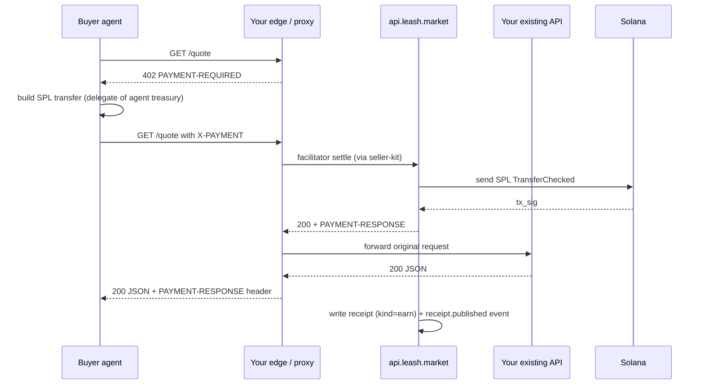

Leash is the easiest way to monetise an HTTP API. You keep your
endpoint exactly as it is. Leash adds the 402, settles the SPL
transfer through a real x402 facilitator, hands the proceeds to a
treasury you control, and writes a chained receipt for every call —
all visible on [`explorer.leash.market`](https://explorer.leash.market).

Three integration shapes are supported, in increasing order of
control:

1. **Hosted payment link** — the fastest. POST a JSON document to
   the API, get a public `https://api.leash.market/x/{id}` paywall
   you can share. No code, no infrastructure, no SDK.
2. **Sidecar mode (Hono / Node middleware)** — drop
   [`@leash/seller-kit`](/sdk/seller-kit) into your existing Node
   service. Add three env vars, ship.
3. **Edge mode (any language)** — sit a tiny worker / proxy in
   front of your route. Use the buyer + seller endpoints to wire
   x402 from Python / Go / Rust / a Cloudflare Worker.

All three produce the same on-chain result, the same explorer
entries, and the same receipt feed.

## Hosted payment links (no code path)

If your monetised endpoint is "return this JSON when paid", a
**payment link** is one HTTP call away:

```bash
curl -X POST https://api.leash.market/v1/payment-links \
  -H "Authorization: Bearer $LEASH_API_KEY" \
  -H "Content-Type: application/json" \
  -d '{
    "label": "Pro tier endpoint",
    "owner_agent": "BcN4ToBs8jE3dbYNhYqDJqGnKPjH3zRX8gsDUDH72JQp",
    "method": "GET",
    "price": "$0.01",
    "currency": "USDC",
    "response": {
      "status": 200,
      "mimeType": "application/json",
      "body": { "ok": true, "tier": "pro" }
    }
  }'
```

You get back a `share_url` like
`https://api.leash.market/x/01HVTQX4GZ`. Share it. Buyers (or
agents) hit it, see a `402` with `PAYMENT-REQUIRED`, sign an SPL
transfer, replay, and your configured response body comes back.
Funds land on the **owner agent's Asset Signer PDA**.

This is the right path when:

- The response body is a fixed (or templated) JSON payload.
- You want zero infrastructure overhead.
- You want a sharable link, not a route inside a larger app.

See [Payment links](/api/payment-links) for the full CRUD surface,
the public `/x/{id}` semantics, and how `payment_link.settled`
events flow into webhooks and the explorer.

## End-to-end flow (sidecar / edge)

When you _do_ have a real route to monetise, the picture looks the
same regardless of which integration shape you pick:



The buyer never sees your service until they pay. Your service
never has to learn x402 — Leash does that handshake on the edge.

## Sidecar mode (TypeScript / Hono)

If your API is a Node service, the cleanest path is
[`@leash/seller-kit`](/sdk/seller-kit). It gives you
`createSeller(app, options)` that adds the 402 middleware in one
line, optionally forwards every produced receipt to the Leash API
on `api.leash.market`, and shows up in the explorer with no extra
code.

```ts
import { Hono } from 'hono';
import { createUmi } from '@metaplex-foundation/umi-bundle-defaults';
import { mplCore } from '@metaplex-foundation/mpl-core';
import { createSeller } from '@leash/seller-kit';

const umi = createUmi(process.env.SOLANA_RPC_URL!).use(mplCore());
const app = new Hono();

createSeller(app, {
  umi,
  sellerAgent: { asset: process.env.LEASH_SELLER_AGENT! },
  routes: {
    'GET /quote': { price: '$0.01', currency: 'USDC' },
  },
  // Receipts forward automatically when both env vars are set:
  //   LEASH_API_URL=https://api.leash.market
  //   LEASH_API_KEY=lsh_live_...
});

app.get('/quote', (c) => c.json({ pair: 'SOL/USD', price: 142.71 }));
```

That's the entire integration. The sidecar will:

- Return `402` for unpaid callers with the right `PAYMENT-REQUIRED`
  headers.
- Verify the buyer's signature, hand it to the configured facilitator,
  and re-run the request once the SPL transfer lands.
- Build a `ReceiptV1` for every settled call and POST it to your
  agent's `/v1/receipts/{agent}` endpoint on the Leash API. Set
  `receipts: false` to keep receipts purely local.

See [`@leash/seller-kit`](/sdk/seller-kit) for the full options surface.

## Edge mode (any language)

If your service is in Python / Go / Rust / a Cloudflare Worker, the
two integration patterns are:

### Option A — point a payment link at your service

The simplest edge integration is to **forward** the payment link's
configured response. You set `webhook_url` on the link to your own
backend; we POST a `payment_link.settled` event there with the
`tx_sig` and `payment_link_id`; you flip a row in your DB
("user X has access for this call") and respond on the next request.

This is the right shape when access is granted asynchronously
(API keys, queue jobs, downloads, etc).

### Option B — script a buyer / seller dance with the v1/buyer endpoints

For a true 402 dance _on a route you already serve_, the
[buyer endpoints](/api/buyer) give you HTTP parity with
`@leash/buyer-kit`. From your service's edge worker:

```bash
# 1. Quote a target URL on behalf of a buyer.
curl -X POST https://api.leash.market/v1/buyer/quote \
  -H "Authorization: Bearer $LEASH_API_KEY" \
  -d '{ "url": "https://api.example.com/quote", "method": "GET" }'

# 2. Once you have an X-PAYMENT signed by the buyer's wallet, replay.
curl -X POST https://api.leash.market/v1/buyer/payment/execute \
  -H "Authorization: Bearer $LEASH_API_KEY" \
  -d '{ "url": "https://api.example.com/quote", "x_payment": "<base64>", "agent": "...", "nonce": 1 }'
```

The execute endpoint replays the request, parses the seller's
`PAYMENT-RESPONSE`, finalizes a `spend` `ReceiptV1`, ingests it into
your account, and returns the seller's response body verbatim plus
the `tx_sig`. See [Buyer endpoints](/api/buyer) for every field.

For the seller side from a polyglot service, the
[seller utilities](/api/seller-utils) (`networks`, `facilitator`,
`parse-price`, `pay-to`) are pure HTTP — useful for validating
prices, resolving the `payTo` PDA, and rendering your own 402
without bundling JS.

## What you get out of the box

- **Pay-per-call settlement.** Real SPL transfer, real on-chain tx,
  real explorer link.
- **Hosted paywalls.** [Payment links](/api/payment-links) at
  `/x/{id}` — no infrastructure, sharable URL, full counters.
- **Receipts feed.** `GET /v1/receipts/{agent}` is ordered, paginated,
  cursor-based. The chain is verifiable end-to-end with
  `verifyReceiptChain` from `@leash/core` — or via
  [`POST /v1/buyer/receipt/verify`](/api/buyer#post-v1buyerreceiptverify)
  if you prefer the HTTP surface.
- **Explorer entries.** Each settled call shows up at
  `https://explorer.leash.market/tx/<signature>` and
  `https://explorer.leash.market/agent/<mint>`.
- **Treasury control.** Funds land on the Asset Signer PDA. Use
  `POST /v1/agents/{mint}/treasury/withdraw/prepare` to pull them out
  to any wallet, signed by the asset's owner.
- **Refunds & cashback.** On the [roadmap](/api/roadmap#refunds--cashback),
  **not yet shipped**. The planned surface is `POST /v1/payments/refund`
  (full inverse transfer) and `POST /v1/payments/cashback` (partial
  rebate based on a `CashbackRulesV1` doc you set per agent —
  e.g. 1% back on every settled call, tiered by ticket size, or a
  loyalty-window rebate every Nth call). Both will write a
  `refund` / `cashback` receipt linked back to the original `tx_sig`
  so the chain stays verifiable end-to-end. Until then, run a manual
  `POST /v1/agents/{mint}/treasury/withdraw/prepare` against the
  buyer's mint as a one-off rebate.

## Deciding between the three

| Question                                     | Hosted link               | Sidecar (seller-kit)            | Edge (buyer/seller v1 endpoints)           |
| -------------------------------------------- | ------------------------- | ------------------------------- | ------------------------------------------ |
| Is your response body a fixed JSON payload?  | **Yes — easiest**         | Works.                          | Works.                                     |
| Is your API in TypeScript / Node?            | Yes (any).                | **Recommended**.                | Works, but heavier.                        |
| Do you want zero new infrastructure?         | **Yes — none**.           | Yes — same process as your API. | Needs an edge worker or extra route.       |
| Does the language need to stay flexible?     | **Yes — any HTTP client** | No — TS only.                   | **Yes — anything with HTTP**.              |
| Do you want a sharable URL?                  | **Yes — built-in**.       | You'd make one yourself.        | You'd make one yourself.                   |
| Do you need 100% offline operation?          | No — paywall is hosted.   | Yes — `receipts: false`.        | No — always calls the Leash API.           |
| Do you want webhook + retry replay for free? | **Yes** — `webhook_url`.  | Coming via runner forward.      | Yes today — the API replays from `events`. |

Most teams start with a **hosted payment link** for the first
revenue endpoint (one curl, no code), move to **sidecar** when the
response body becomes dynamic, and reach for **edge mode** when
polyglot services join the rail.
