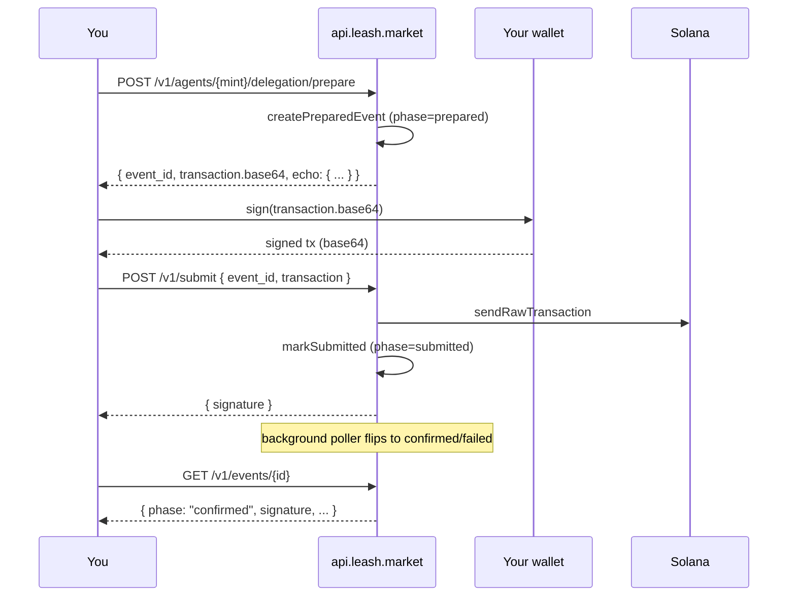

The **Leash API** at [`api.leash.market`](https://api.leash.market) is the
fastest way to monetise an existing API on a per-call basis, run an
agent treasury without operating Solana RPC yourself, and watch every
event your agents produce show up in [`explorer.leash.market`](https://explorer.leash.market) automatically.

It's the same machinery our SDKs use, just exposed as REST + OpenAPI 3.1
so you can call it from any language. You bring the signer, the API
brings everything else: prepare unsigned transactions, broadcast signed
ones, ingest receipts, expose them on a paged feed, and index the
matching on-chain activity into a normalised event stream.

## Why use the API instead of just the SDK

The SDK runs in your process. The API runs on ours.

- **Polyglot.** The SDK is TypeScript-only. The API is HTTP + OpenAPI,
  so you can drive it from Python, Go, Rust, Java, or any language with
  `curl`.
- **No Solana ops.** You never need to run an RPC node, manage RPC
  rate limits, or pin Solana SDK versions — the API talks to both
  clusters for you.
- **Receipt + event surface for free.** Every prepare, every submit,
  every receipt your agents push lands in one queryable feed scoped to
  your account.
- **Explorer integration.** Anything the API sees (or anything our chain
  indexer sees on your watched agents) shows up in the explorer with no
  extra work.

The SDK is still the right choice when you want client-side custody
with no remote dependency, or when you're shipping libraries other
people will install.

## Subdomain layout

| Subdomain               | What it serves                                            |
| ----------------------- | --------------------------------------------------------- |
| `api.leash.market`      | This API. JSON OpenAPI 3.1 spec at `/openapi.json`.       |
| `docs.leash.market`     | This site. API reference is generated from the same spec. |
| `explorer.leash.market` | Protocol explorer over the same data this API persists.   |

## Prepare → Sign → Submit → Track

The API never touches your private keys. Every state-changing call uses
a strict prepare/sign/submit split that mirrors the SDK's
`prepare*` / `send*` boundary:

That same `event_id` later joins to anything the chain indexer picks
up: agents you prepare for are auto-watched and any subsequent
on-chain activity for them shows up in `/v1/events` and on the
explorer's per-agent timeline.

## Network binding via the API key prefix

The API key prefix encodes the network. There is **no per-request
network parameter** — picking the right key picks the right cluster.

| Prefix       | Network          | Use this when…                                                      |
| ------------ | ---------------- | ------------------------------------------------------------------- |
| `lsh_test_*` | `solana-devnet`  | Building, integration tests, CI, demos. Free RPC, faucet stables.   |
| `lsh_live_*` | `solana-mainnet` | Production. Real money, mainnet RPC, mainnet receipts and explorer. |

Cross-network reads are impossible by construction: a `lsh_test_*`
key cannot see a mainnet event row, and a transaction signature that
exists only on devnet returns `404` on a `lsh_live_*` lookup. The same
isolation applies to receipts (`(network, receipt_hash)` is the
storage primary key) and to indexer cursors.

See [Authentication](/api/auth) for issuing keys, the
[Idempotency-Key](/api/idempotency) header for safe retries, and
[Rate limits](/api/rate-limits) for the per-key sliding-window ceiling.

## Endpoint surface (v1)

| Group         | Endpoints                                                                                                                                                                             |
| ------------- | ------------------------------------------------------------------------------------------------------------------------------------------------------------------------------------- |
| Health        | `GET /v1/health`, `GET /v1/version`                                                                                                                                                   |
| Agents        | `GET /v1/agents/{mint}`, `GET /v1/agents/{mint}/treasury/balances`                                                                                                                    |
| Prepare       | 13 routes mapped 1:1 to the SDK's `prepare*` helpers — see [Prepare → Submit](/api/prepare-submit)                                                                                    |
| Submit        | `POST /v1/submit` (signed tx → broadcast)                                                                                                                                             |
| Payment links | `POST/GET/PATCH/DELETE /v1/payment-links`, `POST /v1/payment-links/preview`, public `/x/{id}` paywall                                                                                 |
| Seller utils  | `GET /v1/seller/networks`, `GET /v1/seller/facilitator`, `POST /v1/seller/parse-price`, `GET /v1/agents/{mint}/pay-to`                                                                |
| Buyer         | `POST /v1/buyer/quote`, `POST /v1/buyer/policy/evaluate`, `POST /v1/buyer/payment/{prepare,execute}`, `POST /v1/buyer/receipt/{finalize,verify}`, `GET /v1/buyer/{networks,currency}` |
| Treasury      | `GET /v1/agents/{mint}/treasury/balances`, `POST /v1/agents/{mint}/treasury/{provision,withdraw,withdraw-all,withdraw-sol,withdraw-sol-all}/prepare` — see [Treasury](/api/treasury)  |
| Events        | `GET /v1/events/{id}`, `GET /v1/events?kind=&agent=&cursor=`                                                                                                                          |
| Receipts      | `POST /v1/receipts/{agent}`, `GET /v1/receipts/{agent}`, `GET /v1/receipts/by-hash/{hash}`                                                                                            |
| Pull targets  | `POST /v1/agents/{mint}/pull-target` — register an off-API receipts URL the indexer will poll                                                                                         |
| Indexer       | `GET /v1/indexer/status`                                                                                                                                                              |
| Webhooks      | `POST /v1/webhooks`, `GET /v1/webhooks`, `GET /v1/webhooks/{id}/deliveries`, `DELETE /v1/webhooks/{id}`                                                                               |
| Metrics       | `GET /v1/metrics/usage`, `GET /v1/metrics/events`                                                                                                                                     |
| Admin         | `POST/GET /v1/admin/api-keys`, `POST /v1/admin/api-keys/{id}/disable` — operator-only                                                                                                 |
| OpenAPI       | `GET /openapi.json` — full 3.1 spec (also rendered at [API reference](/api/reference))                                                                                                |

## What's next

- [Authentication](/api/auth) — issuing and rotating keys, prefix
  semantics, and rate limits.
- [Prepare → Submit lifecycle](/api/prepare-submit) — the contract
  every state-changing call follows, with a worked example.
- [Monetise an existing API](/api/monetize-api) — the pattern for
  charging per-call on a SaaS endpoint you already host.
- [Payment links](/api/payment-links) — hosted x402 paywalls served
  at `/x/{id}`. The "Stripe Payment Link" of x402.
- [Seller utilities](/api/seller-utils) — `parse-price`,
  `facilitator`, `networks`, `pay-to`. Mirrors the
  `@leash/seller-kit` exports for polyglot SDKs.
- [Buyer endpoints](/api/buyer) — full HTTP parity with
  `@leash/buyer-kit`: quote, policy gate, prepare, execute,
  receipt finalize/verify.
- [Treasury endpoints](/api/treasury) — read SOL + SPL balances
  on the Asset Signer PDA, provision stable ATAs, and prepare
  owner-driven SPL / SOL withdrawals.
- [Receipts API](/api/receipts) — the push, pull, and feed surface.
- [Indexer](/api/indexer) — what the dual-network worker does and
  how to know it's caught up.
- [Webhooks](/api/webhooks) — push event lifecycle changes to your
  service with HMAC-signed deliveries and exponential retries.
- [Metrics](/api/metrics) — per-key usage rollups and per-network
  event counters for dashboards and billing.
