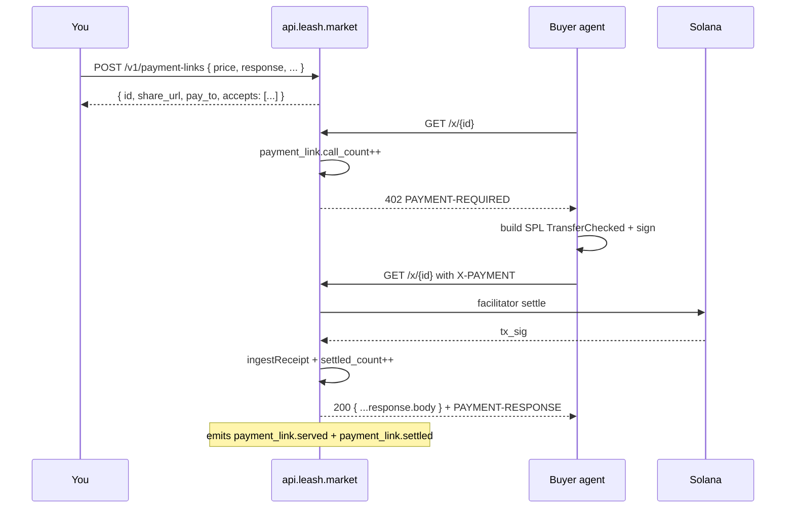

A **payment link** is a small JSON document describing one paid HTTP
endpoint: a method, a path, a price, an accepted stablecoin set, and
the response template to return on success. Once you POST it to the
API, it shows up at a public URL anyone can pay:

```text
https://api.leash.market/x/{id}
```

The link is a real x402 endpoint. Buyers (or any agent driving
[`@leashmarket/buyer-kit`](/sdk/buyer-kit)) hit it, get a `402` with
`PAYMENT-REQUIRED`, sign an SPL `TransferChecked`, replay the request,
and your configured response body comes back. Funds settle directly
into the **owner agent's Asset Signer PDA** (the same treasury
balance you see on `GET /v1/agents/{mint}/treasury/balances`).

You don't need to host anything. You don't need to run a server. The
API is the seller for you.

## When to use payment links vs the SDK

| You want…                                                | Use this                                             |
| -------------------------------------------------------- | ---------------------------------------------------- |
| Charge per call on a JSON endpoint without writing code  | **Payment links** (`POST /v1/payment-links`)         |
| Charge per call on a route in your existing Hono app     | [`@leashmarket/seller-kit`](/sdk/seller-kit)         |
| Charge per call from Python / Go / Rust on your own host | Edge mode (see [Monetise an API](/api/monetize-api)) |
| Build a one-off "Pay $X to download Y" share link        | **Payment links** (sharable URL out of the box)      |

Payment links and the SDK use the same underlying middleware
(`createSeller` from `@leashmarket/seller-kit`). The difference is purely
where the route lives — your process or ours.

## Lifecycle



Every paid request also writes an `earn` `ReceiptV1` for the owner
agent and emits `receipt.published` so the explorer's per-agent
timeline lights up automatically. The chain indexer picks the
`pay_to` PDA up via `ensureWatched` the first time the link is
created, so balance changes show up too.

## Create a link

```http
POST /v1/payment-links
Authorization: Bearer lsh_test_...
Content-Type: application/json

{
  "label": "Tag a payload",
  "owner_agent": "BcN4ToBs8jE3dbYNhYqDJqGnKPjH3zRX8gsDUDH72JQp",
  "method": "POST",
  "price": "$0.001",
  "currency": "USDC",
  "accepts_currencies": ["USDG"],
  "response": {
    "status": 200,
    "mimeType": "application/json",
    "body": { "ok": true, "tagged": true }
  }
}
```

Response:

```json
{
  "id": "01HVTQX4GZ",
  "network": "solana-devnet",
  "label": "Tag a payload",
  "owner_agent": "BcN4…",
  "pay_to": "9pK9…",
  "method": "POST",
  "path": "/x/01HVTQX4GZ",
  "price": "$0.001",
  "currency": "USDC",
  "accepts_currencies": ["USDG"],
  "facilitator": "https://devnet-facilitator.leash.market",
  "share_url": "https://api.leash.market/x/01HVTQX4GZ",
  "accepts": [
    {
      "scheme": "exact",
      "network": "solana:5eykt4UsFv8P8NJdTREpY1vzqKqZKvdpKuc",
      "pay_to": "9pK9…",
      "asset": "4zMM…",
      "amount": "1000",
      "currency": "USDC"
    },
    {
      "scheme": "exact",
      "network": "solana:5eykt4UsFv8P8NJdTREpY1vzqKqZKvdpKuc",
      "pay_to": "9pK9…",
      "asset": "USDG…",
      "amount": "1000",
      "currency": "USDG"
    }
  ],
  "counters": {
    "call_count": 0,
    "settled_count": 0,
    "last_called_at": null,
    "last_settled_at": null,
    "last_tx_sig": null
  },
  "created_at": "2026-04-25T01:00:00.000Z"
}
```

The fields you set:

| Field                | Required | Notes                                                                               |
| -------------------- | -------- | ----------------------------------------------------------------------------------- |
| `label`              | Yes      | Short human name. Shows up in the explorer + dashboards.                            |
| `owner_agent`        | Yes      | Mint of the agent that receives funds. Must be on the caller-scoped network.        |
| `method`             | Yes      | `GET` / `POST` / `PUT` / `PATCH` / `DELETE`. Picks how buyers call the link.        |
| `price`              | Yes      | Display string. Same parser as `@leashmarket/seller-kit`: `"$0.001"`, `"0.5 USDT"`. |
| `currency`           | No       | Default `USDC`. The primary stable used for the atomic amount.                      |
| `accepts_currencies` | No       | Up to 3 extra stables advertised in `accepts[]` (cross-stable settlement).          |
| `response.status`    | No       | Default `200`. Status code returned on a settled call.                              |
| `response.mimeType`  | No       | Default `application/json`.                                                         |
| `response.body`      | Yes      | Object or string. Returned verbatim on settlement.                                  |
| `webhook_url`        | No       | Optional per-link webhook. Fires on `payment_link.settled`.                         |
| `wrap_receipt`       | No       | When `true`, the response body wraps your template alongside the receipt.           |
| `metadata`           | No       | Free-form JSON returned on every read.                                              |
| `id`                 | No       | Pick your own slug (URL-safe). When omitted, the API mints a ULID.                  |

Pricing uses the same `parsePrice` semantics as the SDK — see
[Seller utilities → parse-price](/api/seller-utils#parse-price) for
the wire-level breakdown of every accepted form.

## Read a link

```http
GET /v1/payment-links/{id}
Authorization: Bearer lsh_test_...
```

The response is the same shape as `POST`, with live counters
(`call_count`, `settled_count`, `last_tx_sig`, `last_settled_at`).

`GET /v1/payment-links` (no id) returns a paginated list of links
owned by the caller, newest first. Filter by `?owner_agent=` and
control pagination with `?cursor=&limit=`.

## Update a link

```http
PATCH /v1/payment-links/{id}
Authorization: Bearer lsh_test_...
Content-Type: application/json

{
  "label": "Tag v2",
  "price": "$0.002",
  "response": { "status": 200, "mimeType": "application/json", "body": { "ok": true, "v": 2 } }
}
```

Any subset of the create-time fields can be patched. To soft-disable a
link without losing analytics:

```json
{ "disabled": true }
```

Disabled links return `410 Gone` from the public paywall but stay
queryable via `GET /v1/payment-links/{id}` so you can re-enable them
or read past counters. Disabling emits a `payment_link.updated` event.

## Delete a link

```http
DELETE /v1/payment-links/{id}
Authorization: Bearer lsh_test_...
```

Returns `204 No Content`. Emits a `payment_link.deleted` event. The
slug becomes available for reuse on the same network.

## Preview a draft (no persist)

```http
POST /v1/payment-links/preview
Authorization: Bearer lsh_test_...
Content-Type: application/json

{
  "owner_agent": "BcN4…",
  "method": "POST",
  "price": "$0.001",
  "currency": "USDC",
  "accepts_currencies": ["USDG"]
}
```

Returns the `accepts[]`, the resolved `pay_to`, and the facilitator
the link _would_ use, without writing anything to the database. UIs
use this to render a live "what buyers will see" preview while the
user is editing the form.

## The public paywall: `GET|POST /x/{id}`

The endpoint that serves the link is anonymous on purpose — random
buyers shouldn't need a Leash API key to pay you. It accepts the same
HTTP method you set on the link.

```bash
# First request — no payment header.
curl -i https://api.leash.market/x/01HVTQX4GZ
# HTTP/1.1 402 Payment Required
# PAYMENT-REQUIRED: eyJ4NDAyVmVyc2lvbiI6Mi…
```

Decode `PAYMENT-REQUIRED` (base64 → JSON) to see the offer. The
exact same shape is on `accepts[]` from the `GET /v1/payment-links/{id}`
response — UIs typically pre-render it from the API call, not from
probing the paywall.

To pay, the buyer:

1. Builds an SPL `TransferChecked` from their treasury ATA → the link's `pay_to`.
2. Signs it.
3. Replays the request with the signed transaction in the `X-PAYMENT` header.

The API hands the signed tx to the configured facilitator, the
facilitator settles the SPL transfer on chain, and the API returns
your configured `response.body` plus a `PAYMENT-RESPONSE` header
containing the tx signature.

```bash
# After settlement.
curl -i -H "X-PAYMENT: <signed-base64>" https://api.leash.market/x/01HVTQX4GZ
# HTTP/1.1 200 OK
# PAYMENT-RESPONSE: eyJ0cmFuc2FjdGlvbiI6IjV4WTcuLi4iLC…
# Content-Type: application/json
#
# {"ok":true,"tagged":true}
```

Wrong network in the URL? The API returns a `wrong_network`
hint pointing at the correct cluster. Wrong method? `405`. Disabled?
`410`. Missing slug? `404`.

The `?network=` query string lets buyers force the network when
sharing devnet links. By default, the public paywall resolves to
`solana-mainnet` so production share URLs work without a query
string.

## What lands in the explorer

Every paywall hit emits one or more events:

| Event                  | When it fires                                                          |
| ---------------------- | ---------------------------------------------------------------------- |
| `payment_link.created` | `POST /v1/payment-links` succeeds.                                     |
| `payment_link.updated` | `PATCH /v1/payment-links/{id}` succeeds (incl. `disabled` toggles).    |
| `payment_link.deleted` | `DELETE /v1/payment-links/{id}` succeeds.                              |
| `payment_link.served`  | A buyer hit the public paywall and the seller-kit returned a response. |
| `payment_link.settled` | The buyer paid and the SPL transfer landed on chain. Carries `tx_sig`. |
| `receipt.published`    | The owner-agent earn receipt ingested for that settlement.             |

All of them are queryable via `GET /v1/events?kind=payment_link.*`
and rendered on the explorer's payment-link page at
`https://explorer.leash.market/payment-links/{id}` (when enabled).

## Webhooks

If you want push notifications, subscribe to any of the events above
via [`POST /v1/webhooks`](/api/webhooks). The `payment_link.settled`
event in particular carries the `tx_sig`, the agent that received
the funds, and the `payment_link_id` so your billing system can
reconcile cleanly.

## See also

- [`@leashmarket/seller-kit`](/sdk/seller-kit) — the same middleware,
  hosted in your own process.
- [Seller utilities](/api/seller-utils) — `parse-price`,
  `facilitator`, `networks`, `pay-to`. Useful for validating drafts
  before you POST them.
- [Buyer endpoints](/api/buyer) — the symmetric surface for the
  buyer side: `quote`, `payment/prepare`, `payment/execute`.
- [Monetise an API](/api/monetize-api) — when to use payment links
  vs the SDK vs an edge proxy.
