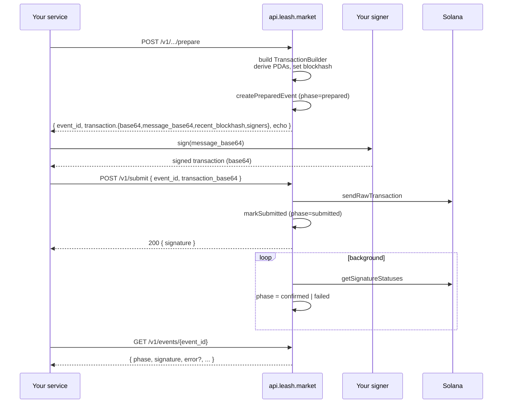

The Leash API never holds your private keys. Every state-changing call
splits into four distinct steps, and you are always the one who signs.



## Why split it

The split is the difference between a vendor and an HSM:

- **Custody stays with you.** No bytes of secret material ever cross
  the API boundary. The same key model works whether you're driving
  Privy, Phantom, a Turnkey policy, a TEE, or an env-loaded keypair.
- **Idempotent retries.** Prepare is a pure function of inputs and
  network; calling it twice with the same `Idempotency-Key` returns
  the same event id and transaction bytes. Submit is the only call
  that can land on chain, and it is also idempotent on `event_id`.
- **Race-free reads.** The `event_id` exists _before_ the transaction
  is broadcast, so you can persist it next to your domain object,
  re-read it, and never miss a state transition. The
  [explorer](https://explorer.leash.market) and
  [`GET /v1/events`](/api/reference#get-v1events) both join on it.

## The prepare endpoints

Each one wraps a `prepare*` function from `@leash/registry-utils`,
returns the wire-encoded transaction, and creates a `prepared` event:

| Endpoint                                                   | SDK function                    | What it does                                                         |
| ---------------------------------------------------------- | ------------------------------- | -------------------------------------------------------------------- |
| `POST /v1/agents/prepare`                                  | `prepareAgentMint`              | Mint a brand-new agent (Core asset + on-chain identity).             |
| `POST /v1/agents/{mint}/identity/prepare`                  | `prepareRegisterAgentIdentity`  | Re-register identity on an existing asset.                           |
| `POST /v1/agents/{mint}/executive/register/prepare`        | `prepareRegisterExecutive`      | Bind a wallet as an executive for this agent.                        |
| `POST /v1/agents/{mint}/executive/delegate/prepare`        | `prepareDelegateExecution`      | Let the executive sign `Execute` for this asset.                     |
| `POST /v1/agents/{mint}/delegation/prepare`                | `prepareSetSpendDelegation`     | Owner approves the executive as SPL delegate up to a cap.            |
| `POST /v1/agents/{mint}/delegation/revoke/prepare`         | `prepareRevokeSpendDelegation`  | Drop the SPL delegate to zero.                                       |
| `POST /v1/agents/{mint}/token/set/prepare`                 | `prepareSetAgentToken`          | Set the `agent_token` field on the identity plugin.                  |
| `POST /v1/agents/{mint}/treasury/provision/prepare`        | `prepareProvisionTreasuryAtas`  | Pre-create stable ATAs on the treasury PDA.                          |
| `POST /v1/agents/{mint}/treasury/withdraw/prepare`         | `prepareWithdrawTreasury`       | Owner moves a specific SPL amount out of the treasury.               |
| `POST /v1/agents/{mint}/treasury/withdraw-all/prepare`     | `prepareWithdrawTreasuryAll`    | Owner drains the full SPL balance (or `no_op` when zero).            |
| `POST /v1/agents/{mint}/treasury/withdraw-sol/prepare`     | `prepareWithdrawTreasurySol`    | Owner moves lamports out of the treasury.                            |
| `POST /v1/agents/{mint}/treasury/withdraw-sol-all/prepare` | `prepareWithdrawTreasurySolAll` | Owner drains all SOL above a configurable safety reserve.            |
| `POST /v1/buyer/payment/prepare`                           | (buyer-kit `prepareTransfer`)   | Build an unsigned SPL `TransferChecked` for a buyer x402 settlement. |

`POST /v1/agents/prepare` is the HTTP twin of
[`prepareAgentMint`](/sdk/registry-utils): it calls the Metaplex Agents
API under the hood, returns the unsigned transaction in the same
prepared envelope as every other route, and pre-registers the asset +
treasury PDA on the indexer watchlist so the explorer lights up the
moment the signed tx lands. The SDK helper remains available for
TypeScript callers that want to skip the HTTP hop.

<Note>
  **Indexer follow-up after your first agent action.** `POST
  /v1/agents/prepare` and every `/v1/agents/{mint}/...` prepare
  endpoint auto-register the agent asset + treasury PDA on the
  indexer watchlist (via `ensureWatched`). That's enough for the
  explorer to surface mints, withdraws, identity changes,
  delegations, and token updates.

It is **not** enough to surface incoming SPL deposits, because plain
`TransferChecked` transactions don't list the PDA — they list the
ATA. To make `agent.treasury.fund` events show up too, do **one**
of the following exactly once per agent:

- Hit `POST /v1/agents/{mint}/treasury/provision/prepare` (registers
  the ATAs it provisions), **or**
- Hit `POST /v1/agents/{mint}/treasury/withdraw/prepare` (registers
  the source ATA), **or**
- Hit `GET /v1/agents/{mint}/treasury/balances` — read-only, free,
  and registers the PDA + every SPL ATA it sees in one call.

The `/treasury/balances` call is the recommended "make this agent
fully visible to the explorer" step right after your first
successful submit. See [Explorer tracking](/api/explorer-tracking)
for the full per-event matrix.

</Note>

Each response uses the same shape:

```json
{
  "event_id": "01HVTQX4GZTH8XK1F2JZ7N5WJ4",
  "network": "solana-devnet",
  "transaction": {
    "base64": "AQABAv…",
    "message_base64": "AQABAv…",
    "recent_blockhash": "GZNb…",
    "last_valid_block_height": 320489201,
    "fee_payer": "HQbJ…",
    "signers": ["HQbJ…", "9XQ2…"]
  },
  "echo": {
    /* function-specific extras (asset, collection, ATA, etc.) */
  }
}
```

`signers` is the ordered set of pubkeys the API expects on the
`message_base64` you return to `/v1/submit`. `base64` is the same
transaction with empty signature slots — most polyglot SDKs sign
that directly with `signTransaction(tx, [signer])` and POST the
resulting bytes back. `fee_payer` is the first account in the
message and is always the first entry of `signers`.

A small subset of helpers can short-circuit when there's nothing to
do — provision-when-already-provisioned, withdraw-all-when-empty.
They return a "no-op" envelope with a `null` event id and no
`transaction`:

```json
{
  "event_id": null,
  "network": "solana-devnet",
  "transaction": null,
  "echo": {
    /* same shape as the active envelope */
  },
  "no_op": true
}
```

## The submit endpoint

```http
POST /v1/submit
Authorization: Bearer lsh_test_...
Idempotency-Key: 8b3a…              # optional but recommended
Content-Type: application/json

{
  "event_id": "01HVTQX4GZTH8XK1F2JZ7N5WJ4",
  "transaction_base64": "AQABAv…",   # signed full tx, base64
  "client_reference": "order-42"     # optional
}
```

- **Validates** the signed tx parses, blockhash is fresh, and
  `event_id` is in `phase = prepared` (not already submitted).
- **Broadcasts** via the API's RPC pool.
- **Stamps** the event to `phase = submitted` with the returned
  signature.
- **Returns** `200 OK` with `{ event_id, signature, phase: "submitted", network }`.
  Confirmation is a separate poll.

A background tick polls `getSignatureStatuses` for every
`submitted` event and flips it to `confirmed` (with `confirmed_at`,
`slot`, `block_time`) or `failed` (with `error_code`, `error_logs`).

## Tracking the result

```bash
curl https://api.leash.market/v1/events/$EVENT_ID \
  -H "Authorization: Bearer $LEASH_API_KEY"
```

```json
{
  "id": "01HVTQX4GZTH8XK1F2JZ7N5WJ4",
  "kind": "agent.delegation.set",
  "phase": "confirmed",
  "network": "solana-devnet",
  "agent_asset": "9pK9…",
  "signature": "5xY7…",
  "block_time": 1714004532,
  "metadata": { "stable_symbol": "USDC", "allowance_atomic": "100000000" },
  "client_reference": "order-42"
}
```

The same event lands in the explorer's transaction view at
`https://explorer.leash.market/tx/<signature>` (devnet or mainnet
depending on the API key prefix that produced it).

## Worked example: set a USDC delegation

```bash
# 1. Prepare
PREP=$(curl -sX POST https://api.leash.market/v1/agents/$MINT/delegation/prepare \
  -H "Authorization: Bearer $LSH_TEST_KEY" \
  -H "Idempotency-Key: $(uuidgen)" \
  -d '{ "executive": "'$EXEC'", "stable_symbol": "USDC", "allowance": "100" }')

EVENT_ID=$(echo "$PREP" | jq -r '.event_id')
TX=$(echo "$PREP"       | jq -r '.transaction.base64')

# 2. Sign locally — anything that produces a base64-signed full tx works.
#    With Umi:  signTransaction(umi.transactions.deserialize(bytes), [signer])
SIGNED=$(node ./sign.mjs "$TX")

# 3. Submit
curl -sX POST https://api.leash.market/v1/submit \
  -H "Authorization: Bearer $LSH_TEST_KEY" \
  -d "{ \"event_id\": \"$EVENT_ID\", \"transaction_base64\": \"$SIGNED\" }"

# 4. Track
curl -s https://api.leash.market/v1/events/$EVENT_ID \
  -H "Authorization: Bearer $LSH_TEST_KEY" | jq .
```

That's the entire surface for any Leash state change. Every prepare
shares the contract, every submit shares the contract, every event
shares the schema.

- [Monetise an existing API](/api/monetize-api) — plug this lifecycle
  into a SaaS that already exists.
- [Explorer tracking](/api/explorer-tracking) — the per-event-kind
  cookbook: which `prepare → submit` pair (or which on-chain
  trigger) makes each row show up on the explorer.
