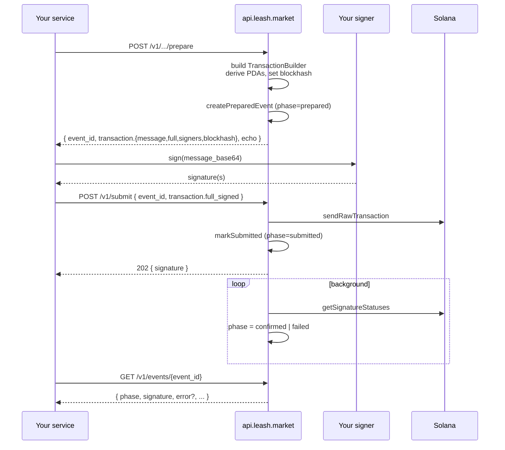

The Leash API never holds your private keys. Every state-changing call
splits into four distinct steps, and you are always the one who signs.



## Why split it

The split is the difference between a vendor and an HSM:

- **Custody stays with you.** No bytes of secret material ever cross
  the API boundary. The same key model works whether you're driving
  Privy, Phantom, a Turnkey policy, a TEE, or an env-loaded keypair.
- **Idempotent retries.** Prepare is a pure function of inputs and
  network; calling it twice with the same `Idempotency-Key` returns
  the same event id and transaction bytes. Submit is the only call
  that can land on chain, and it is also idempotent on `event_id`.
- **Race-free reads.** The `event_id` exists _before_ the transaction
  is broadcast, so you can persist it next to your domain object,
  re-read it, and never miss a state transition. The
  [explorer](https://explorer.leash.market) and
  [`GET /v1/events`](/api/reference#get-v1events) both join on it.

## The prepare endpoints

Each one wraps a `prepare*` function from `@leash/registry-utils`,
returns the wire-encoded transaction, and creates a `prepared` event:

| Endpoint                                               | SDK function                   | What it does                                                |
| ------------------------------------------------------ | ------------------------------ | ----------------------------------------------------------- |
| `POST /v1/agents/prepare`                              | `prepareCreateAgent`           | Mint Core asset + Agent Identity in one tx.                 |
| `POST /v1/agents/{mint}/identity/prepare`              | `prepareRegisterAgentIdentity` | Re-register identity on an existing asset.                  |
| `POST /v1/executive/prepare`                           | `prepareRegisterExecutive`     | Bind a wallet as an executive once per cluster.             |
| `POST /v1/agents/{mint}/executive/delegate/prepare`    | `prepareDelegateExecution`     | Per-agent: let the executive sign `Execute` for this asset. |
| `POST /v1/agents/{mint}/delegation/prepare`            | `prepareSetSpendDelegation`    | Owner approves the executive as SPL delegate up to a cap.   |
| `POST /v1/agents/{mint}/delegation/revoke/prepare`     | `prepareRevokeSpendDelegation` | Drop the SPL delegate to zero.                              |
| `POST /v1/agents/{mint}/treasury/provision/prepare`    | `prepareProvisionTreasuryAtas` | Pre-create stable ATAs on the treasury PDA.                 |
| `POST /v1/agents/{mint}/treasury/withdraw/prepare`     | `prepareWithdrawTreasury`      | Owner moves SPL out of the treasury.                        |
| `POST /v1/agents/{mint}/treasury/withdraw-sol/prepare` | `prepareWithdrawTreasurySol`   | Owner moves lamports out of the treasury.                   |
| `POST /v1/agents/{mint}/token/prepare`                 | `prepareSetAgentToken`         | Set the `agent_token` field on the identity plugin.         |
| `POST /v1/agents/{mint}/token/launch/prepare`          | `prepareAgentTokenLaunch`      | Genesis-flow token launch + bind to the agent.              |
| `POST /v1/launches/sign/prepare`                       | `prepareSignAndSendLaunch`     | Sign the multi-tx Genesis launch in one call.               |
| `POST /v1/agents/{mint}/pause/prepare`                 | `preparePauseAgent`            | Toggle the on-chain `paused` flag (when wired).             |

Each response uses the same shape:

```json
{
  "event_id": "01HVTQX4GZTH8XK1F2JZ7N5WJ4",
  "network": "solana-devnet",
  "transaction": {
    "message_base64": "AQABAv…",
    "full_base64": "AQABAv…",
    "blockhash": "GZNb…",
    "signers": ["HQbJ…", "9XQ2…"]
  },
  "echo": {
    /* function-specific extras (asset, collection, ATA, etc.) */
  }
}
```

`signers` is the ordered set of pubkeys the API expects on the
`message_base64` you return to `/v1/submit`. `full_base64` is the
same transaction with the API's noop signers stripped — sign that
when your client only knows how to consume a fully-formed tx.

## The submit endpoint

```http
POST /v1/submit
Authorization: Bearer lsh_test_...
Idempotency-Key: 8b3a…              # optional but recommended
Content-Type: application/json

{
  "event_id": "01HVTQX4GZTH8XK1F2JZ7N5WJ4",
  "transaction": "AQABAv…",         # signed full tx, base64
  "client_reference": "order-42"     # optional
}
```

- **Validates** the signed tx parses, blockhash is fresh, and
  `event_id` is in `phase = prepared` (not already submitted).
- **Broadcasts** via the API's RPC pool.
- **Stamps** the event to `phase = submitted` with the returned
  signature.
- **Returns** `202 Accepted` with `{ signature }`. Confirmation is a
  separate poll.

A background tick polls `getSignatureStatuses` for every
`submitted` event and flips it to `confirmed` (with `confirmed_at`,
`slot`, `block_time`) or `failed` (with `error_code`, `error_logs`).

## Tracking the result

```bash
curl https://api.leash.market/v1/events/$EVENT_ID \
  -H "Authorization: Bearer $LEASH_API_KEY"
```

```json
{
  "id": "01HVTQX4GZTH8XK1F2JZ7N5WJ4",
  "kind": "agent.delegation.set",
  "phase": "confirmed",
  "network": "solana-devnet",
  "agent_asset": "9pK9…",
  "signature": "5xY7…",
  "block_time": 1714004532,
  "metadata": { "stable_symbol": "USDC", "allowance_atomic": "100000000" },
  "client_reference": "order-42"
}
```

The same event lands in the explorer's transaction view at
`https://explorer.leash.market/tx/<signature>` (devnet or mainnet
depending on the API key prefix that produced it).

## Worked example: set a USDC delegation

```bash
# 1. Prepare
PREP=$(curl -sX POST https://api.leash.market/v1/agents/$MINT/delegation/prepare \
  -H "Authorization: Bearer $LSH_TEST_KEY" \
  -H "Idempotency-Key: $(uuidgen)" \
  -d '{ "executive": "'$EXEC'", "stable_symbol": "USDC", "allowance": "100" }')

EVENT_ID=$(echo "$PREP" | jq -r '.event_id')
MSG=$(echo "$PREP"      | jq -r '.transaction.full_base64')

# 2. Sign locally — anything that produces a base64-signed full tx works.
SIGNED=$(node ./sign.mjs "$MSG")

# 3. Submit
curl -sX POST https://api.leash.market/v1/submit \
  -H "Authorization: Bearer $LSH_TEST_KEY" \
  -d "{ \"event_id\": \"$EVENT_ID\", \"transaction\": \"$SIGNED\" }"

# 4. Track
curl -s https://api.leash.market/v1/events/$EVENT_ID \
  -H "Authorization: Bearer $LSH_TEST_KEY" | jq .
```

That's the entire surface for any Leash state change. Every prepare
shares the contract, every submit shares the contract, every event
shares the schema. See [Monetise an existing API](/api/monetize-api)
for plugging this into a SaaS that already exists.
