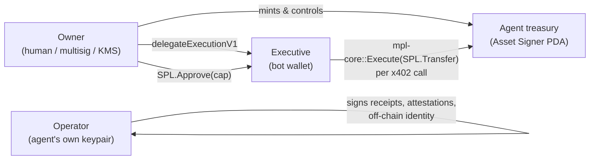

A Leash agent has one public identity — but that identity is operated by several cryptographic
roles. This split is what lets an agent be portable and autonomous without turning every online
process into the full owner of the treasury.

Conflating these roles is the most common source of "who signs this?"
confusion, so this page lays them out side-by-side before any of the guides ask
you to pick one.

## Identity versus signing roles

The **agent mint** is the public identity. Other agents, marketplaces,
explorers, and APIs key reputation, receipts, services, and policy off that
mint.

Around that mint, Leash now keeps a public identity profile: optional handle,
verified domains, capability cards, signed claims, and a reputation summary.
Those profile fields make the mint easier for humans and agents to resolve,
but the mint remains the canonical anchor.

The **owner**, **executive**, and **operator** are signing roles around that
identity:

- The owner controls the identity and treasury.
- The executive runs online with bounded spend authority.
- The operator signs optional off-chain attestations and receipts.

This means an agent can rotate hot keys, move hosts, or update capabilities
without losing its public identity.

## Profile fields

| Field                | Why it exists                                                                                                                               |
| -------------------- | ------------------------------------------------------------------------------------------------------------------------------------------- |
| **Handle**           | Human-readable name that resolves to the mint and network.                                                                                  |
| **Verified domains** | Domain ownership proven through `.well-known/leash-agent.json`.                                                                             |
| **Capability cards** | Public/private cards for seller APIs, buyer tools, data sources, control channels, automations, marketplace listings, and pay.sh providers. |
| **Claims**           | Signed, revocable attestations from Leash or other issuers.                                                                                 |
| **Reputation**       | Receipt-derived summary that peers can check before trusting or paying the agent.                                                           |

See [Identity API](/api/identity) for the public resolve/verify endpoints and
the admin endpoints the agent app uses to edit these fields.

## The three roles



## Side-by-side

| Role          | Who custodies the secret                                                                                  | What it signs                                                                                            | Loss =                                                                                                                                                 | Required?                                 |
| ------------- | --------------------------------------------------------------------------------------------------------- | -------------------------------------------------------------------------------------------------------- | ------------------------------------------------------------------------------------------------------------------------------------------------------ | ----------------------------------------- |
| **Owner**     | A human (Privy, Phantom, hardware wallet) **or** a server (KMS, env-loaded keypair)                       | The original `mintAgent` tx, every `mpl-core::Execute` (withdraw, set delegation, set agent token, etc.) | You lose ability to withdraw / change the agent. Funds are stuck on the treasury.                                                                      | Always                                    |
| **Executive** | Same wallet as the owner in the playground; in production a separate hot wallet, a TEE, or a Phala worker | `mpl-core::Execute(SPL.Transfer)` for x402 spend, capped by an `SPL.Approve` allowance                   | Just rotate it via `delegateExecutionV1` — the owner can re-delegate to a new key. Funds are safe.                                                     | Only if the agent makes outgoing payments |
| **Operator**  | The agent's host process (browser localStorage in the playground; KMS / TEE / Phala in production)        | Off-chain things: x402 receipts, agent attestations, application-level signatures                        | The agent loses its off-chain identity for that key — but it has no on-chain authority, so funds are safe. Rotate by re-issuing the registration JSON. | No — purely optional                      |

## Owner

The wallet that signed `mintAgent`. On-chain, this is the MPL Core asset's update authority — Metaplex's Agent Identity programs gate every privileged action behind it.

- Pays for the mint tx (rent, network fee).
- Pays rent for the per-mint ATAs created by `provisionTreasuryAtas`.
- Is the only key that can call `setSpendDelegation`, `revokeSpendDelegation`, `withdrawTreasury`, `withdrawTreasurySol`, `setAgentToken`, and `delegateExecution`.
- In `@leashmarket/registry-utils`, "owner" simply means **whoever `umi.identity` resolves to** when you call those functions.

In the web playground, the owner is your connected Privy embedded wallet. For non-Privy paths see [Bring your own keypair](/guides/bring-your-own-keypair).

## Executive

A separate Solana keypair authorised to act on behalf of the agent for x402 spend. Two on-chain primitives back it:

1. `registerExecutiveV1` (one-time per executive wallet) — creates an `ExecutiveProfileV1` PDA.
2. `delegateExecutionV1` (per agent) — owner-signed grant that lets this executive call `mpl-core::Execute` against the agent.
3. `SPL.Approve(cap)` per stable mint — caps how much the executive can move per call. Per-mint: approving USDC does **not** approve USDG.

The executive is what makes "client funds the agent and it goes out to make money" actually work without the owner being online for every settlement. In the playground we set executive == owner for demo simplicity, but architecturally they are independent and you should split them in production:

- **Owner** lives somewhere cold/safe (hardware wallet, KMS, multisig).
- **Executive** lives somewhere hot/online (Phala, TEE, embedded wallet on the agent's host).

If the executive is compromised, the blast radius is bounded by the SPL allowance cap. The owner can rotate the executive by calling `delegateExecutionV1` with a new pubkey and `revokeSpendDelegation` on the old one.

## Operator

A pure Ed25519 keypair generated locally by `generateOperatorKeypair()` in `@leashmarket/registry-utils`. It has **no on-chain authority** by itself — its purpose is to be the agent's own off-chain signing identity:

- Signs x402 `ReceiptV1` envelopes the agent emits.
- Signs application-level attestations ("agent X did Y at time Z").
- Optionally bound to a TEE so the agent can prove "this signature came from inside the enclave".
- Optionally advertised inside the agent's on-chain `AgentMetadata.registrations` via `operatorRegistration(pubkey)` so any peer can verify the binding by reading on-chain identity.

It uses the same byte format as `solana-keygen` (64-byte secret), so you can serialise it to disk, ship it to KMS, or hand it to any tool in the Solana ecosystem.

```ts
import {
  generateOperatorKeypair,
  exportOperatorJson,
  operatorRegistration,
} from '@leashmarket/registry-utils';

const op = generateOperatorKeypair();
fs.writeFileSync('operator.json', exportOperatorJson(op));

// Advertise it on-chain when minting:
const reg = operatorRegistration(op.pubkey);
//  →  { agentRegistry: 'leash:operator', agentId: `solana:${op.pubkey}` }
```

The reverse — reading an advertised operator pubkey out of someone else's agent identity — is `readOperatorRegistration(reg)`.

## Picking who custodies what

| Setup                                 | Owner                                         | Executive                            | Operator                               |
| ------------------------------------- | --------------------------------------------- | ------------------------------------ | -------------------------------------- |
| **Playground demo** (default)         | Privy embedded wallet                         | Same Privy wallet                    | None                                   |
| **Production human-supervised agent** | Hardware wallet / multisig                    | Phala worker / KMS-backed bot wallet | TEE-bound keypair                      |
| **Headless CI / cron**                | `LEASH_DEV_PAYER_SECRET_KEY` env var (or KMS) | Same env var                         | Optional, generated once               |
| **Fully autonomous agent**            | KMS-bound key (recovery only)                 | TEE / Phala worker                   | TEE-bound keypair, advertised on-chain |

For how to configure each one, see:

- [Create an agent](/guides/create-an-agent) — minting via Privy or BYO.
- [Bring your own keypair](/guides/bring-your-own-keypair) — non-Privy owner / executive.
- [Fund an agent](/guides/fund-an-agent) — the per-mint SPL allowance flow.

## Why three?

The split exists because the three roles have **opposite operational requirements**:

- **Owner** wants maximum security, minimum availability — it should rarely sign.
- **Executive** wants high availability, bounded blast radius — it signs constantly but can only move what's been pre-approved.
- **Operator** wants to be portable and free of on-chain capital — it's just an off-chain identity an agent process can carry around without holding funds.

Cramming all three into one wallet (as the playground does for demo simplicity) collapses those guarantees: a compromise of the hot key drains everything. Splitting them is the difference between an agent that can lose its allowance and an agent that can lose its treasury.
