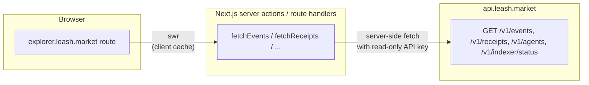

[`explorer.leash.market`](https://explorer.leash.market) is the
public window into the Leash protocol. It looks and feels like
[Solscan](https://solscan.io) — search, addresses, transactions,
status pills — but every screen is built around the **Leash
domain model**: agents, executives, treasuries, allowances, and
chained receipts.

It's a thin standalone Next.js app that reads exclusively from
[`api.leash.market`](https://api.leash.market). No RPC calls from
the browser, no key material, no protocol logic duplicated.

## What you can find

| Search                                  | Resolves to                                                                  |
| --------------------------------------- | ---------------------------------------------------------------------------- |
| Solana address (32-byte base58)         | `/agent/<mint>` if it's a registered agent, else `/address/<addr>`            |
| Transaction signature                   | `/tx/<sig>` with the decoded Leash event(s) plus a Solscan deeplink          |
| Receipt hash (`0x…` or 64-hex)          | `/receipt/<hash>` with the full chain context                                |
| Event id (`01HVTQX…`)                   | `/event/<id>` with prepare → submit → confirm timeline                       |

A typo or unknown value lands on a "not on this network" page that
suggests switching clusters.

## Network switch

The header has a single toggle: **Devnet** ↔ **Mainnet**. Flipping
it:

- Calls a different `api.leash.market` key (`lsh_test_*` vs
  `lsh_live_*`) under the hood.
- Re-issues every active query — no stale data leaks across
  networks.
- Updates every Solscan deeplink (`?cluster=devnet` vs nothing).

A devnet-only signature returns 404 on mainnet; the explorer makes
this explicit: "Not found on mainnet — try devnet?".

## Pages

- **`/`** — recent prepare/submit transactions, recent receipts,
  recent agents, indexer status pill.
- **`/agent/<mint>`** — identity, treasury balances, allowance state,
  paginated event timeline, paginated receipt feed, owner / executive
  pubkeys, advertised `services.receipts` URL, and a "view on Solscan"
  link for every column.
- **`/tx/<sig>`** — decoded Leash event(s) for the transaction,
  status, slot, block time, raw program logs, and the Solscan deeplink.
- **`/receipt/<hash>`** — full receipt JSON, prev/next chain
  navigation, link to the matching transaction.
- **`/event/<id>`** — prepare → submit → confirm phases with
  timestamps; on `phase=confirmed` the entry deeplinks to `/tx/<sig>`.
- **`/health`** — public mirror of `/v1/indexer/status` per network
  with freshness pills.

## Design

The explorer ships with the same brand palette as the docs and the
playground (`#9b8cff` primary, dark-first). The layout is denser
than the docs — heavy on monospaced columns, status pills, and
inline truncation with copy-on-hover.

It is deliberately *not* a generic Solana explorer. Solscan exists,
and we deeplink to it everywhere. The Leash explorer's job is to
explain **what just happened in protocol terms** ("Owner approved
executive `9XQ2…` to spend up to `100 USDC` from agent `9pK9…`")
rather than dumping the raw instruction array.

## How it talks to the API

The browser never holds the API key — every fetch is a server
action that calls the API with a read-only `lsh_*_explorer_*` key
scoped to the active network. SWR caches on the client for instant
back-and-forth between agent and transaction views.

See the [Explorer source](https://github.com/metaplex-foundation/leash/tree/main/apps/explorer)
for the full implementation, including the network switcher and the
server actions that talk to `api.leash.market`.
