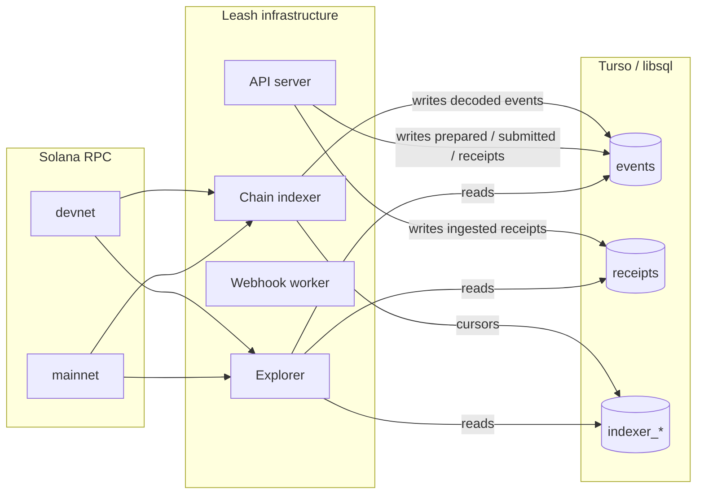

[`explorer.leash.market`](https://explorer.leash.market) is the
public window into the Leash protocol. It looks and feels like
[Solscan](https://solscan.io) — search, addresses, transactions,
status pills — but every screen is built around the **Leash
domain model**: agents, executives, treasuries, allowances, and
chained receipts.

It's a server-rendered Next.js app that runs as part of the same
infrastructure as the API, the chain indexer, and the webhook
worker. Pages render straight from the protocol's own source of
truth — no API key, no protocol logic duplicated, no extra
network hop.

## What you can find

| Search                          | Resolves to                                                         |
| ------------------------------- | ------------------------------------------------------------------- |
| Solana address (32-byte base58) | `/agent/<mint>` if it's a registered agent, else `/address/<addr>`  |
| Transaction signature           | `/tx/<sig>` with the decoded Leash event(s) plus a Solscan deeplink |
| Receipt hash (`0x…` or 64-hex)  | `/receipt/<hash>` with the full chain context                       |
| Event id (`01HVTQX…`)           | `/event/<id>` with prepare → submit → confirm timeline              |

A typo or unknown value lands on a "not on this network" page that
suggests switching clusters.

## Network switch

The header has a single toggle: **Devnet** ↔ **Mainnet**. Flipping
it:

- Re-issues every active query against the other network — no stale
  data leaks across clusters.
- Updates every Solscan deeplink (`?cluster=devnet` vs nothing).

Devnet and mainnet records live in the same database under different
`network` columns (`solana-devnet` / `solana-mainnet`); the explorer
filters every read by the active network so a devnet receipt hash
returns 404 on mainnet, and the page tells you so explicitly.

## Pages

- **`/`** — recent prepare/submit transactions, recent receipts,
  recent agents, indexer status pill.
- **`/agent/<mint>`** — identity, treasury balances, allowance state,
  paginated event timeline, paginated receipt feed, owner / executive
  pubkeys, advertised `services.receipts` URL, and a "view on Solscan"
  link for every column.
- **`/tx/<sig>`** — decoded Leash event(s) for the transaction,
  status, slot, block time, raw program logs, and the Solscan deeplink.
- **`/receipt/<hash>`** — full receipt JSON, prev/next chain
  navigation, link to the matching transaction.
- **`/event/<id>`** — prepare → submit → confirm phases with
  timestamps; on `phase=confirmed` the entry deeplinks to `/tx/<sig>`.
- **`/health`** — indexer freshness for both networks: watchlist size,
  cursor activity, per-kind event counts in the last hour.

## Design

The explorer ships with the same brand palette as the docs and the
playground (`#9b8cff` primary, dark-first). The layout is denser
than the docs — heavy on monospaced columns, status pills, and
inline truncation with copy-on-hover.

It is deliberately _not_ a generic Solana explorer. Solscan exists,
and we deeplink to it everywhere. The Leash explorer's job is to
explain **what just happened in protocol terms** ("Owner approved
executive `9XQ2…` to spend up to `100 USDC` from agent `9pK9…`")
rather than dumping the raw instruction array.

## How it gets its data

The explorer is the fourth process inside the protocol's
infrastructure. The other three (API, indexer, webhook worker) all
read and write the same Turso/libsql database; the explorer reads
the same database and the same Solana RPCs directly.

The pieces:

- **List views** (`/`, `/events`, `/agent/<mint>`'s timeline + receipt
  feed, `/event/<id>`, `/tx/<sig>`, `/receipt/<hash>`, `/health`) all
  read directly from the shared database — the same `events` and
  `receipts` tables the API writes to.
- **Live agent panels** on `/agent/<mint>` (identity status, treasury
  PDA, native SOL + SPL balances) call the same Solana RPCs the API
  uses, in-process, via the snapshot helpers exported from `@leash/api`.
- The browser only ever sees `'devnet' | 'mainnet'` (carried by the
  `leash_network` cookie). All database and RPC reads happen on the
  Next.js server.

This co-location is intentional. The explorer is internal infra, not a
third-party API consumer, so it shouldn't have to authenticate
against a service it already shares a trust boundary with.

## Making your activity appear here

The explorer renders whatever the API and the chain indexer write into
the shared `events` and `receipts` tables. Two simple rules cover the
whole surface:

1. **API-driven actions** (every state-changing call: identity,
   delegation, withdraws, payment links, receipts) need the full
   `prepare → submit` round-trip via the API. Calls that stop at
   `prepare` show up as `phase=prepared` and never advance.
2. **Indexer-only actions** (incoming SPL or SOL deposits to a
   treasury, SDK-driven `Execute`s the API didn't initiate) require
   the agent to be on the indexer watchlist. The cheapest way to
   force-register is one `GET /v1/agents/{mint}/treasury/balances`
   call — read-only, free, side-effects three watch kinds at once.

For the per-event-kind matrix — every `kind` value the explorer
shows, with the exact endpoint or on-chain trigger that surfaces it
— see [Explorer tracking](/api/explorer-tracking).
